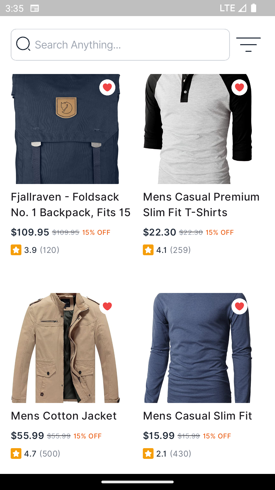
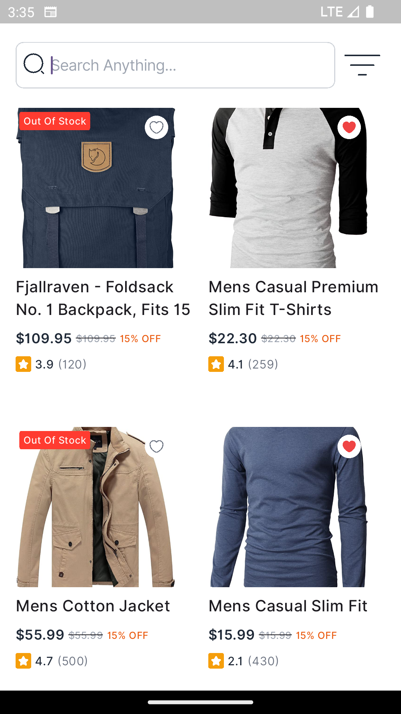
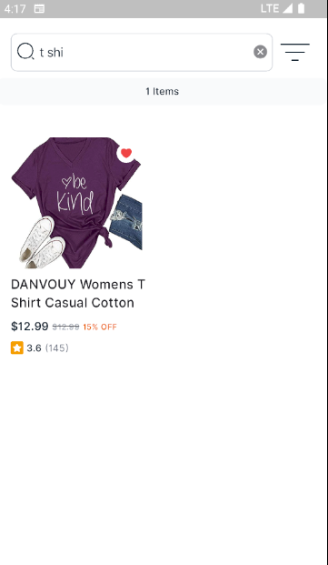
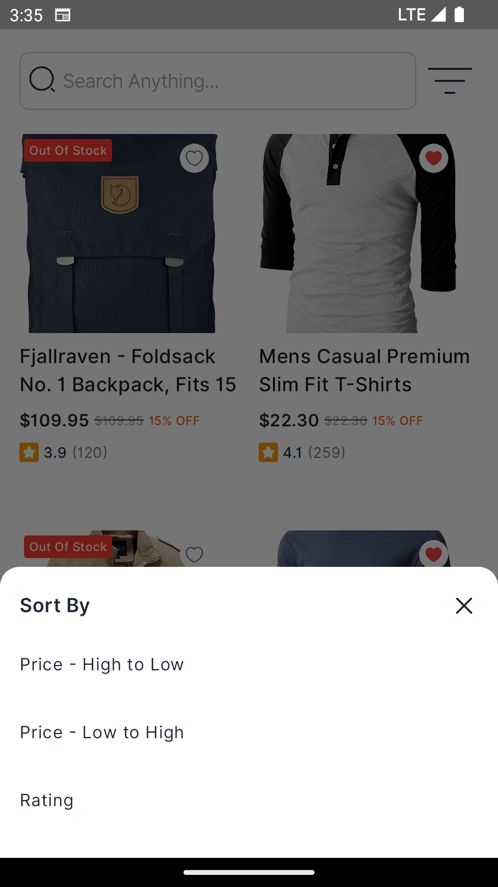

# E-Commerce Product App (Flutter)

A Flutter-based eCommerce app that displays products from an API with features like **search**, **pagination**, and **sorting**, following **clean architecture principles** and using **Riverpod** for state management.

---

## Features

-  Product listing in GridView
-  Limit-based Pagination
-  Search products by name
-  Sort by price (low to high, high to low, ratting)
-  Clean architecture
-  Responsive UI

---

## Screenshots

# Home Screen
 
 
# Search Active

# Sort Dialog

---

## Technologies Used

- Flutter 3+
- Dart
- Riverpod
- REST API (with limit-based pagination)
- Clean Architecture Principles

---

